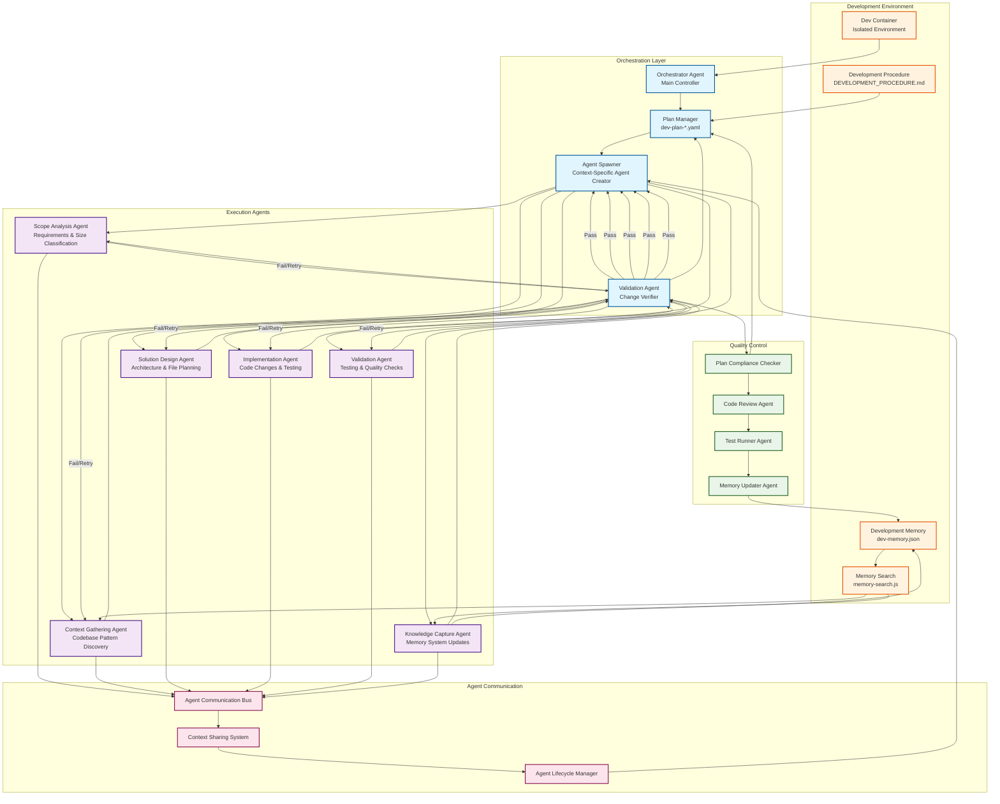

# AI Agent Orchestration Architecture

## System Overview
This diagram illustrates the multi-agent orchestration system for the "Let Me Know" application, leveraging the existing dev container, development procedure, and memory systems.



## Detailed Agent Specifications

### Orchestrator Agent
- **Purpose**: Main controller that manages the entire development workflow
- **Responsibilities**:
  - Parse incoming requests and initialize plan files
  - Monitor overall progress and handle failures
  - Coordinate agent lifecycle and resource allocation
  - Maintain global context and state

### Agent Spawner
- **Purpose**: Creates context-specific agents for each development phase
- **Responsibilities**:
  - Generate custom prompts based on current phase and context
  - Initialize agents with specific tools and constraints
  - Monitor agent completion and trigger validation
  - Handle agent termination and cleanup

### Validation Agent
- **Purpose**: Verifies changes against plan requirements
- **Responsibilities**:
  - Compare completed work against plan specifications
  - Run automated tests and quality checks
  - Determine if changes are acceptable or need retry
  - Update plan status and trigger next phase or retry

### Execution Agents (Phase-Specific)

#### Scope Analysis Agent
```yaml
tools: [Read, Grep, Glob, Memory Search]
constraints: 
  - Must classify size: micro|small|medium|large|epic
  - Must decompose epic tasks into subtasks
  - Must query memory for similar work
custom_prompt: |
  You are a scope analysis specialist. Your job is to parse requirements,
  classify task size, and decompose complex features. Use memory search
  to find similar implementations. Focus only on analysis, not implementation.
```

#### Context Gathering Agent
```yaml
tools: [Read, Grep, Glob, Memory Search, Task]
constraints:
  - Must identify existing patterns
  - Must locate reusable components  
  - Must document test patterns
custom_prompt: |
  You are a codebase explorer. Search for related components, existing patterns,
  and test structures. Document all findings for implementation agents.
  Focus on understanding, not changing code.
```

#### Solution Design Agent
```yaml
tools: [Read, Write (for design docs)]
constraints:
  - Must create architecture sketches for >small tasks
  - Must list affected files with line numbers
  - Must define integration points
custom_prompt: |
  You are a solution architect. Create detailed implementation plans
  based on context findings. Design before building. Document all
  architectural decisions.
```

#### Implementation Agent
```yaml
tools: [Read, Edit, MultiEdit, Write, Bash]
constraints:
  - Must write tests first (TDD)
  - Must run tests after each change
  - Must follow existing patterns
custom_prompt: |
  You are an implementation specialist. Follow the solution design exactly.
  Write failing tests first, implement minimal solutions, refactor as needed.
  Respect existing code conventions.
```

#### Validation Agent
```yaml
tools: [Bash, Read]
constraints:
  - Must run full test suite
  - Must perform manual testing checklist
  - Must check security if auth/data related
custom_prompt: |
  You are a quality assurance specialist. Run comprehensive tests,
  validate functionality, and ensure security standards.
  Report detailed validation results.
```

#### Knowledge Capture Agent
```yaml
tools: [Read, Write, Memory Search, Bash (for memory-search.js)]
constraints:
  - Must update memory with new patterns
  - Must document gotchas and solutions
  - Must maintain tag consistency
custom_prompt: |
  You are a knowledge curator. Capture learnings, patterns, and gotchas
  discovered during development. Use memory search tools to maintain
  consistency and avoid duplication.
```

## Agent Communication Protocol

### Message Types
- `PHASE_COMPLETE`: Agent signals completion with results
- `PHASE_FAILED`: Agent signals failure with error details
- `VALIDATION_PASS`: Validation agent approves changes
- `VALIDATION_FAIL`: Validation agent requests retry
- `PLAN_UPDATE`: Plan modifications from any agent
- `CONTEXT_SHARE`: Shared context between agents

### Lifecycle Management
1. **Spawn**: Create agent with custom prompt and constraints
2. **Monitor**: Track progress and resource usage
3. **Validate**: Check work against plan requirements
4. **Retry/Continue**: Based on validation results
5. **Terminate**: Clean up and capture final state

## Integration Points

### Existing Systems
- **Dev Container**: Provides isolated execution environment
- **Development Procedure**: Drives agent workflow phases
- **Memory System**: Provides knowledge persistence and search
- **Plan Files**: Track progress and coordinate agents

### Quality Gates
- Each phase must pass validation before proceeding
- Plan compliance checked at every step
- Memory system updated with new learnings
- Test suite must pass before completion
