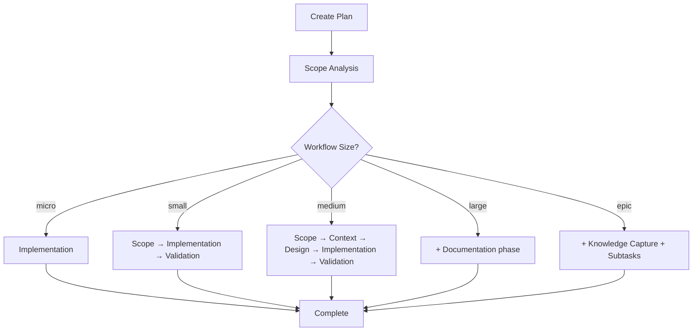

# Development Planning Skills

Two integrated skills for managing structured development workflows:
- **create-plan**: Creates structured development plans
- **execute-plan**: Executes plans phase by phase

## Quick Start

### Creating a Plan

```
User: skill create-plan
Claude: What task would you like to create a development plan for?
User: Add user profile editing feature
Claude: [Creates plan in .llms/dev-plan-user-profile-editing.md]
```

### Executing a Plan

```
User: skill execute-plan
Claude: [Finds and executes current phase of active plan]
```

## Workflow Overview



## Plan Structure

Plans are stored in `.llms/` directory as markdown files:

```
.llms/
├── dev-plan-feature-x.md          # Main plan
├── dev-plan-feature-y.md          # Another plan
└── subtasks/
    ├── dev-plan-feature-x-api.md  # Subtask of feature-x
    └── dev-plan-feature-x-ui.md   # Another subtask
```

## Workflow Sizes

| Size | Phases | Use Case |
|------|--------|----------|
| **micro** | 1 | Single file, trivial change |
| **small** | 3 | 2-3 files, straightforward |
| **medium** | 5 | Multiple files, needs design |
| **large** | 6 | Many files, needs documentation |
| **epic** | 7 | Major feature, needs subtasks |

## Phase Execution Flow

1. **Scope Analysis**: Understand requirements, assess complexity
2. **Context Gathering**: Explore codebase, find patterns
3. **Solution Design**: Create architecture, plan implementation
4. **Implementation**: Write code, follow checklist
5. **Validation**: Test changes, fix issues
6. **Documentation**: Update docs, add comments
7. **Knowledge Capture**: Extract learnings, document patterns

## Git Integration

Both skills follow strict git practices:

- Creates feature branches: `feature/[task-slug]`
- Commits after each phase completion
- **Never** commits to main/master
- **Never** pushes without permission
- **Never** merges without approval

## Example Workflow

### 1. Create a Plan

```bash
# User invokes create-plan skill
skill create-plan

# Claude asks for task details
"Add JWT authentication to the API"

# Claude creates plan
Created: .llms/dev-plan-jwt-authentication.md
Workflow: large (6 phases)
Branch: feature/jwt-authentication
```

### 2. Execute Phase by Phase

```bash
# Start execution
skill execute-plan

# Phase 1: Scope Analysis
- Analyzes requirements
- Identifies 8 files to modify
- Classifies as "large" workflow
- Commits: "chore: scope analysis for JWT auth"

# Phase 2: Context Gathering
- Explores existing auth code
- Finds patterns to follow
- Documents dependencies
- Commits: "docs: context gathering for JWT auth"

# Phase 3: Solution Design
- Creates architecture
- Designs token flow
- Creates 10-item checklist
- Commits: "docs: solution design for JWT auth"

# Phase 4: Implementation
- Works through checklist
- Creates JWT service
- Adds middleware
- Updates endpoints
- Commits: "feat: implement JWT authentication"

# Phase 5: Validation
- Runs tests
- Finds 2 issues
- Fixes issues
- All tests pass
- Commits: "test: validate JWT implementation"

# Phase 6: Documentation
- Updates README
- Adds API docs
- Creates usage guide
- Commits: "docs: add JWT authentication documentation"
```

### 3. Plan Completion

```
Plan Status: Completed ✓
Total Commits: 6
Files Modified: 12
Tests Passing: All
Documentation: Updated

Ready to create pull request (won't push/merge without permission)
```

## Working with Subtasks

For epic workflows, plans can have subtasks:

```markdown
## Subtasks
1. [User Model Updates](subtasks/dev-plan-auth-user-model.md) - Completed ✓
2. [JWT Service](subtasks/dev-plan-auth-jwt-service.md) - In Progress
3. [Auth Middleware](subtasks/dev-plan-auth-middleware.md) - Pending
```

Execute subtasks individually or through parent plan:

```bash
skill execute-plan
# Detects subtask in progress
# Offers to continue subtask or switch
```

## Progress Tracking

Plans track progress with:
- **Status indicators**: Pending → In Progress → Completed ✓
- **Checkboxes**: `- [ ]` → `- [x]` for tasks
- **Progress logs**: Timestamped events
- **Git commits**: Listed per phase

## Validation and Fix Cycles

When validation fails:

```markdown
### Fix Cycles
#### Cycle 1
**Issues**:
1. Token expiry not handled
2. Refresh endpoint missing

**Status**: In Progress
```

The execute-plan skill will:
1. Create fix cycle in plan
2. Address issues
3. Re-run validation
4. Continue until all tests pass

## Best Practices

1. **Start with create-plan** for any non-trivial task
2. **Let Claude determine workflow size** based on complexity
3. **Execute phases sequentially** - don't skip ahead
4. **Commit frequently** - after each phase minimum
5. **Document findings** - update plan as you learn
6. **Test continuously** - catch issues early
7. **Never rush validation** - ensure quality

## Common Commands

```bash
# Create a new plan
skill create-plan

# Execute current plan
skill execute-plan

# List existing plans
ls -la .llms/*.md

# Check current plan status
cat .llms/dev-plan-*.md | grep "Status"

# View current git branch
git branch --show-current
```

## Troubleshooting

### No Active Plan
```
"No plans found in .llms/"
→ Run: skill create-plan
```

### Wrong Branch
```
"Not on feature branch"
→ Let Claude switch branches
→ Or manually: git checkout feature/[branch]
```

### Tests Failing
```
"Validation failed with N issues"
→ Claude will create fix cycle
→ Re-run validation after fixes
```

### Dirty Working Directory
```
"Uncommitted changes detected"
→ Let Claude commit or stash
→ Or manually: git stash
```

## Integration with Other Tools

These skills work well with:
- **TodoWrite**: Tracks high-level progress
- **Task tool**: Spawns agents for specific phases
- **Git commands**: Manages version control
- **Test runners**: Validates implementations

## Tips for Success

1. **Be specific** when describing tasks
2. **Trust the process** - phases exist for a reason
3. **Review plans** before execution
4. **Update findings** as you discover information
5. **Keep plans focused** - one feature per plan
6. **Use subtasks** for complex features
7. **Document learnings** for future reference

## Advanced Usage

### Parallel Subtasks
For independent subtasks, execute in parallel:
```
Subtask 1: API changes (independent)
Subtask 2: UI changes (independent)
→ Can work on both simultaneously
```

### Custom Workflows
Modify workflow templates in:
- `create-plan/templates.md`
- Adjust phases per project needs

### Automation
Chain skills for continuous execution:
```
create-plan → execute-plan → create-pr
```

## Getting Help

- View skill details: `cat claude-setup/skills/*/SKILL.md`
- See examples: `cat claude-setup/skills/*/examples.md`
- Check templates: `cat claude-setup/skills/create-plan/templates.md`